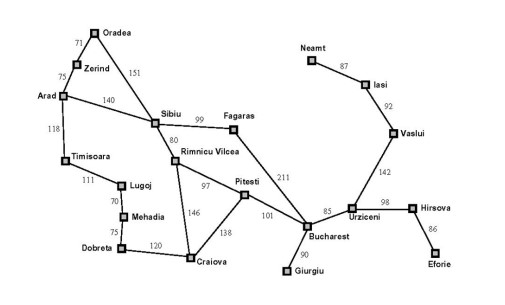

# Fundamentos de los Sistemas Inteligentes
## Práctica 1 - Branch_and_bound_P1.1

### Introducción 📋
_En esta práctica se implementará una estrategia de búsqueda no informada recurrente como es la ramificación y acotación, del inglés, Branch and Bound.
Como sabemos, esta se basa en ordenar la lista abierta. Lo haremos teniendo en cuenta el coste acumulado de cada trayectoria parcial, que en nuestro caso será cada una de estas, un nodo en la lista abierta.\
Para comenzar contaremos con un nodo inicial en esta lista, que expandiremos y generaremos nuevos caminos o, en definitiva, rafimicaciones de nuevos nodos hijos._


### El grafo📦
_Trabajaremos sobre un grafo de las ciudades de Rumanía._




### Lista abierta implementada como una cola (Queue) ⚙️
_La cual implementamos de las siguientes formas para comparar la cantidad de nodos expandidos frente a los métodos de búsqueda en anchura._


        Stack(): Cola LiFo
        FIFOQueue(): Cola FiFo
        BandBQueue(Queue): Nuestro Branch&Bound
        BandBHeuristicQueue(Queue): Con Heurística

## Heurística 📌
La búsqueda ramificación y acotación es la primera estrategia que hemos seguido. Pero seguidamente,
aplicamos una estimación heurística hasta el estado final para ordenar la lista abierta.
Considerando la siguiente nueva función de coste:
                   ```f(n) = g(n) + h(n)```


Donde ```g(n)``` representa el coste acumulado y ```h(n)``` la heurística utilizada. 
A tener en cuenta que el el valor heurístico ```h(n)``` debe ser siempre menor o igual al valor heurístico ```h(n’)``` más el coste del
nodo ```n``` al ```n’``` mediante la acción a. Matemáticamente: ```h(n) ≤ c(n, a, n’) + h(n’)```
* Como heurística se ha optado por usar la distancia en línea recta entre cada estado y el estado final.


## Autores ✒️

_Alumnos que han desarollado la práctica_

* **Nahima Ortega Rodríguez** - [nahimaort](https://github.com/nahimaort)
* **Sebastián Fernández García** - [sebastianfernandezgarcia](https://github.com/sebastianfernandezgarcia)

_Código base proporcionado por [Cayetano Guerra Artal](https://cayetanoguerra.github.io/ia/)_
